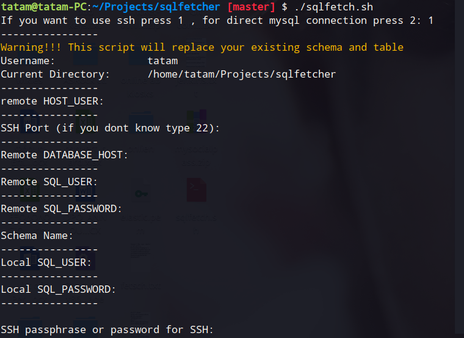
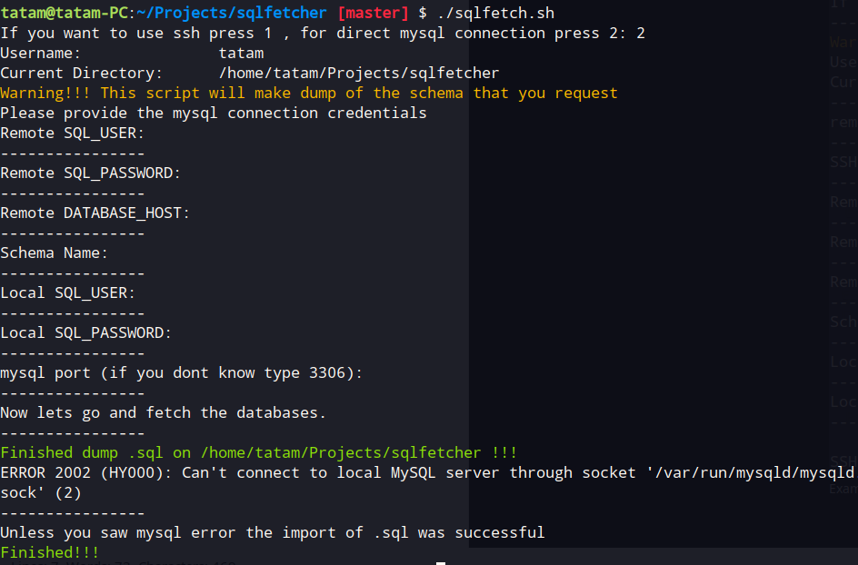

# SQLFETCH README
Hello everybody, sqletch.sh is a bash script that can go and fetch from remote hosts using ssh or direct connection dumps and import to localhost by given all the proper credentials.
The commands migh need sudo if you dont have proper permissions
To excecute you should change it to executable by typing  chmod 755 sqlfetch.sh and use it by typing ./sqlscript.sh .
Example of the ssh (1) way:

Example of the direct(2)way:

Attention !! please do not leave the ports blank.